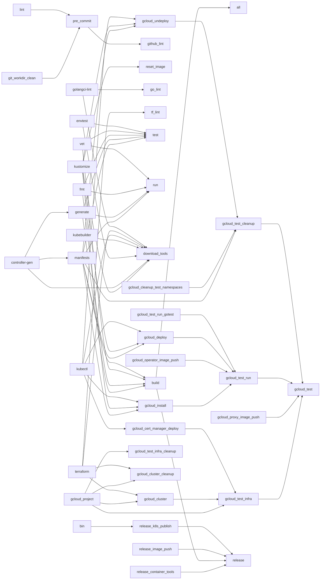

Release Artifacts

- container
- kubernetes declarations yaml file
- install.sh script
- (future) helm chart

```mermaid
graph LR;

build--->all
pre_commit--->github_lint
git_workdir_clean--->pre_commit
lint--->pre_commit
kustomize--->reset_image
golangci-lint--->go_lint
terraform--->tf_lint
controller-gen--->manifests
controller-gen--->generate
manifests--->test
generate--->test
fmt--->test
vet--->test
envtest--->test
generate--->build
fmt--->build
vet--->build
manifests--->build
manifests--->run
generate--->run
fmt--->run
vet--->run
kustomize--->download_tools
controller-gen--->download_tools
envtest--->download_tools
kubebuilder--->download_tools
kubectl--->download_tools
terraform--->download_tools
golangci-lint--->download_tools
gcloud_test_infra--->gcloud_test
gcloud_proxy_image_push--->gcloud_test
gcloud_test_run--->gcloud_test
gcloud_test_cleanup--->gcloud_test
gcloud_project--->gcloud_test_infra
gcloud_cluster--->gcloud_test_infra
gcloud_cert_manager_deploy--->gcloud_test_infra
gcloud_install--->gcloud_test_run
gcloud_operator_image_push--->gcloud_test_run
gcloud_deploy--->gcloud_test_run
gcloud_test_run_gotest--->gcloud_test_run
manifests--->gcloud_test_cleanup
gcloud_cleanup_test_namespaces--->gcloud_test_cleanup
gcloud_undeploy--->gcloud_test_cleanup
gcloud_project--->gcloud_test_infra_cleanup
gcloud_project--->gcloud_cluster
terraform--->gcloud_cluster
gcloud_project--->gcloud_cluster_cleanup
terraform--->gcloud_cluster_cleanup
kubectl--->gcloud_cert_manager_deploy
manifests--->gcloud_install
kustomize--->gcloud_install
kubectl--->gcloud_install
manifests--->gcloud_deploy
kustomize--->gcloud_deploy
kubectl--->gcloud_deploy
manifests--->gcloud_undeploy
kustomize--->gcloud_undeploy
kubectl--->gcloud_undeploy
bin--->release_k8s_publish
release_container_tools--->release
build--->release
release_image_push--->release
release_k8s_publish--->release

```
